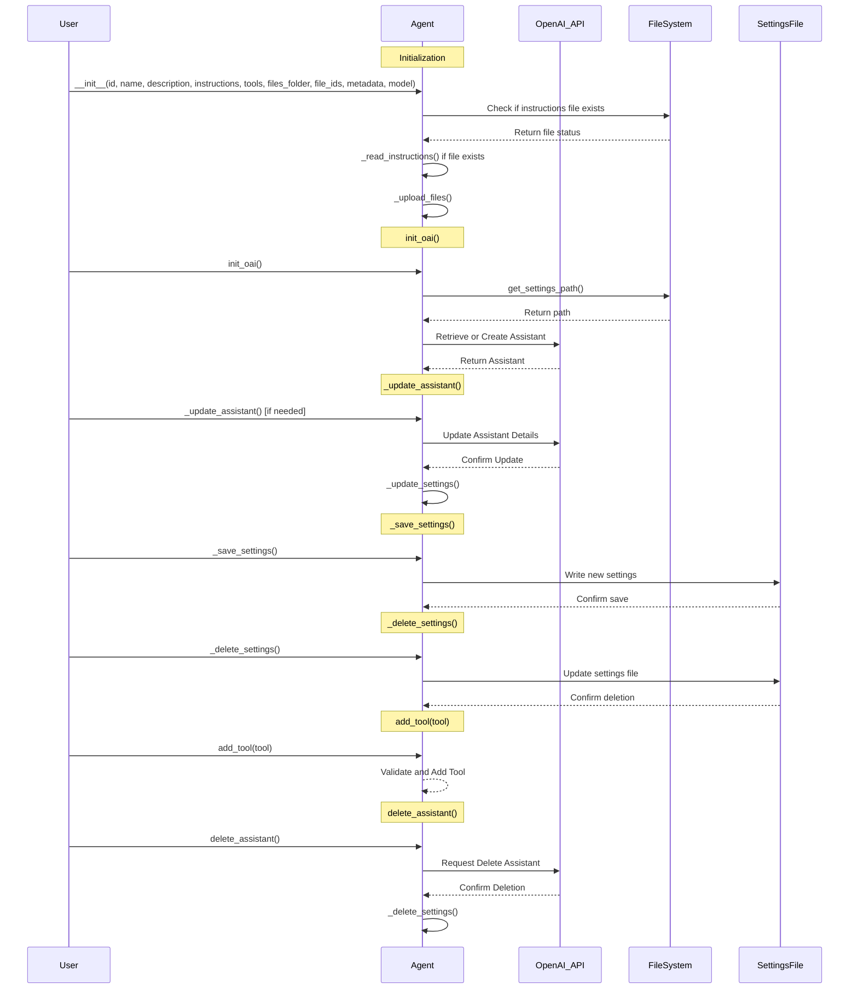

```mermaid

sequenceDiagram
    participant User
    participant Agent
    participant OpenAI_API
    participant FileSystem
    participant SettingsFile

    Note over Agent: Initialization
    User->>Agent: __init__(id, name, description, instructions, tools, files_folder, file_ids, metadata, model)
    Agent->>FileSystem: Check if instructions file exists
    FileSystem-->>Agent: Return file status
    Agent->>Agent: _read_instructions() if file exists
    Agent->>Agent: _upload_files()

    Note over Agent: init_oai()
    User->>Agent: init_oai()
    Agent->>FileSystem: get_settings_path()
    FileSystem-->>Agent: Return path
    Agent->>OpenAI_API: Retrieve or Create Assistant
    OpenAI_API-->>Agent: Return Assistant

    Note over Agent: _update_assistant()
    User->>Agent: _update_assistant() [if needed]
    Agent->>OpenAI_API: Update Assistant Details
    OpenAI_API-->>Agent: Confirm Update
    Agent->>Agent: _update_settings()

    Note over Agent: _save_settings()
    User->>Agent: _save_settings()
    Agent->>SettingsFile: Write new settings
    SettingsFile-->>Agent: Confirm save

    Note over Agent: _delete_settings()
    User->>Agent: _delete_settings()
    Agent->>SettingsFile: Update settings file
    SettingsFile-->>Agent: Confirm deletion

    Note over Agent: add_tool(tool)
    User->>Agent: add_tool(tool)
    Agent-->>Agent: Validate and Add Tool

    Note over Agent: delete_assistant()
    User->>Agent: delete_assistant()
    Agent->>OpenAI_API: Request Delete Assistant
    OpenAI_API-->>Agent: Confirm Deletion
    Agent->>Agent: _delete_settings()

```