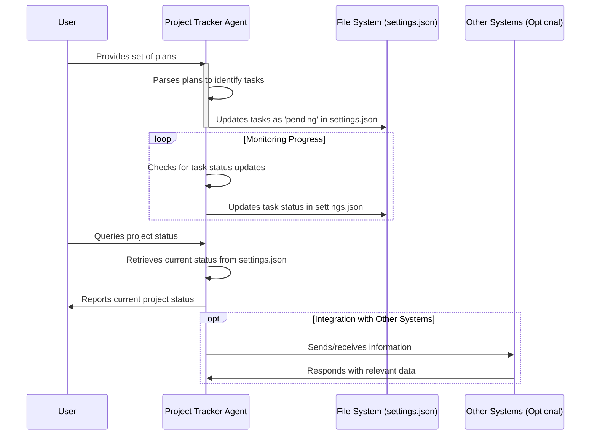

```mermaid
sequenceDiagram
    participant U as User
    participant A as Project Tracker Agent
    participant F as File System (settings.json)
    participant O as Other Systems (Optional)

    U->>A: Provides set of plans
    activate A
    A->>A: Parses plans to identify tasks
    A->>F: Updates tasks as 'pending' in settings.json
    deactivate A
    loop Monitoring Progress
        A->>A: Checks for task status updates
        A->>F: Updates task status in settings.json
    end
    U->>A: Queries project status
    A->>A: Retrieves current status from settings.json
    A->>U: Reports current project status

    opt Integration with Other Systems
        A->>O: Sends/receives information
        O->>A: Responds with relevant data
    end
```
