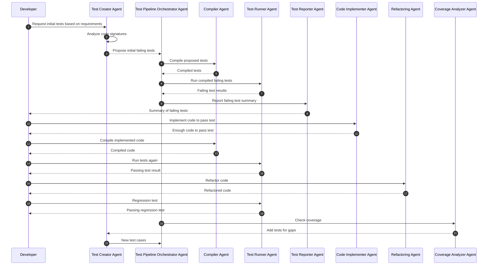

```mermaid
sequenceDiagram
autonumber

Developer->>Test Creator Agent: Request initial tests based on requirements
Test Creator Agent->>Test Creator Agent: Analyze code signatures
Test Creator Agent-->>Test Pipeline Orchestrator Agent: Propose initial failing tests

Test Pipeline Orchestrator Agent->>Compiler Agent: Compile proposed tests
Compiler Agent-->>Test Pipeline Orchestrator Agent: Compiled tests

Test Pipeline Orchestrator Agent->>Test Runner Agent: Run compiled failing tests
Test Runner Agent-->>Test Pipeline Orchestrator Agent: Failing test results

Test Pipeline Orchestrator Agent->>Test Reporter Agent: Report failing test summary
Test Reporter Agent-->>Developer: Summary of failing tests

Developer->>Code Implementer Agent: Implement code to pass test
Code Implementer Agent-->>Developer: Enough code to pass test

Developer->>Compiler Agent: Compile implemented code
Compiler Agent-->>Developer: Compiled code

Developer->>Test Runner Agent: Run tests again
Test Runner Agent-->>Developer: Passing test result

Developer->>Refactoring Agent: Refactor code
Refactoring Agent-->>Developer: Refactored code

Developer->>Test Runner Agent: Regression test
Test Runner Agent-->>Developer: Passing regression test

Test Pipeline Orchestrator Agent->>Coverage Analyzer Agent: Check coverage
Coverage Analyzer Agent-->>Test Creator Agent: Add tests for gaps

Test Creator Agent->>Test Pipeline Orchestrator Agent: New test cases
```