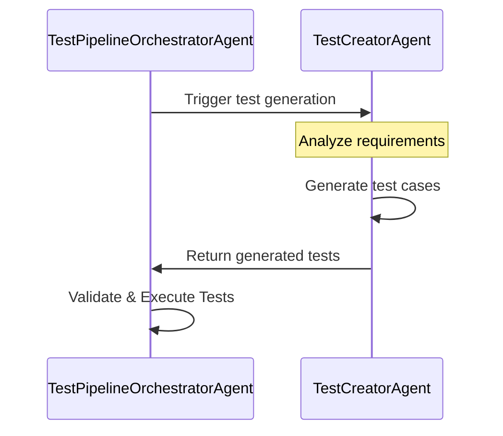

*Objective:* Develop a `TestCreatorAgent` for a Test-Driven Development (TDD) system, integrated with a `TestPipelineOrchestratorAgent`. The `TestCreatorAgent` should be designed to create and manage test cases efficiently within the TDD framework.  It should also fit seamlessly with our Agent Swarm.

*Background and Requirements:*

1. **TestCreatorAgent Overview:**
   - The `TestCreatorAgent` is a crucial component of the TDD system. It is responsible for automatically generating test cases based on specific requirements and parameters. As described in our documentation (snippet provided below), the agent uses algorithms to create a comprehensive set of tests that cover various scenarios and edge cases.
   - *Snippet from 'test_creator_agent.md':* "The TestCreatorAgent utilizes advanced algorithms to extrapolate potential test scenarios, ensuring thorough coverage of the software's functionalities."

2. **Integration with TestPipelineOrchestratorAgent:**
   - The `TestPipelineOrchestratorAgent` manages the overall testing pipeline, coordinating between different agents, including the TestCreatorAgent. It triggers the TestCreatorAgent to create tests and then orchestrates the execution of these tests. A key snippet from the 'TestPipelineOrchestratorAgent.py' file illustrates this interaction:
   - *Snippet from 'TestPipelineOrchestratorAgent.py':* "self.test_creator_agent.generate_tests() - This method call initiates the TestCreatorAgent to start test case generation."

3. **Functionality:**
   - The TestCreatorAgent should be able to:
     - Generate test cases based on predefined criteria and input parameters.
     - Validate the generated test cases for completeness and correctness.
     - Interface seamlessly with the TestPipelineOrchestratorAgent.

4. **Mermaid Sequence Diagram:**
   - The following sequence diagram illustrates the interaction between the TestCreatorAgent and TestPipelineOrchestratorAgent:



*Task:*

Using the provided information and sequence diagram, develop the `TestCreatorAgent` with the following capabilities:
- Efficient and dynamic test case generation.
- Ability to interface with the `TestPipelineOrchestratorAgent` as outlined.
- Ensure the agent's code is modular, well-documented, and adheres to best coding practices.

5. ** TestPipelineOrchestratorAgent Python Source Code ***

```python
from abc import ABC, abstractmethod
from typing import List, Callable

# Observer Pattern: Define Observer interface for listening to test pipeline events.
class ITestPipelineObserver(ABC):
    @abstractmethod
    def on_test_compiled(self):
        """Called when tests are compiled."""
        pass

    @abstractmethod
    def on_test_executed(self):
        """Called when tests are executed."""
        pass

    @abstractmethod
    def on_test_reported(self):
        """Called when tests are reported."""
        pass

# Strategy Pattern: Define Strategy interface for various test pipeline strategies.
class ITestStrategy(ABC):
    @abstractmethod
    def execute_strategy(self):
        """Execute the specific strategy."""
        pass

# Concrete Strategy for Compilation
class CompileStrategy(ITestStrategy):
    def execute_strategy(self):
        # Compilation logic goes here
        pass

# Concrete Strategy for Test Execution
class ExecuteTestsStrategy(ITestStrategy):
    def execute_strategy(self):
        # Test execution logic goes here
        pass

# Concrete Strategy for Test Reporting
class ReportTestsStrategy(ITestStrategy):
    def execute_strategy(self):
        # Test reporting logic goes here
        pass

# Command Pattern: Command interface for test pipeline operations.
class ITestCommand(ABC):
    @abstractmethod
    def execute(self):
        """Execute the command."""
        pass

# Concrete Command for initiating test pipeline steps.
class TestPipelineCommand(ITestCommand):
    def __init__(self, strategy: ITestStrategy):
        self.strategy = strategy

    def execute(self):
        self.strategy.execute_strategy()

# Test Pipeline Orchestrator Agent
class TestPipelineOrchestratorAgent:
    def __init__(self):
        self.observers: List[ITestPipelineObserver] = []
        self.current_command: ITestCommand = None

    def add_observer(self, observer: ITestPipelineObserver):
        """Add an observer to the orchestrator."""
        self.observers.append(observer)

    def set_command(self, command: ITestCommand):
        """Set the current command for the orchestrator."""
        self.current_command = command

    def execute_command(self):
        """Execute the current command and notify observers."""
        if self.current_command:
            self.current_command.execute()
            self.notify_observers()

    def notify_observers(self):
        """Notify all observers about specific events."""
        for observer in self.observers:
            # Notify observers about specific events
            pass

# Example usage
if __name__ == "__main__":
    orchestrator = TestPipelineOrchestratorAgent()
    compile_command = TestPipelineCommand(CompileStrategy())
    orchestrator.set_command(compile_command)
    orchestrator.execute_command()

    # Further logic to add observers and execute different strategies
```


The first time g4 wrote this, it did not inherit from the Agent class.
asking again...
