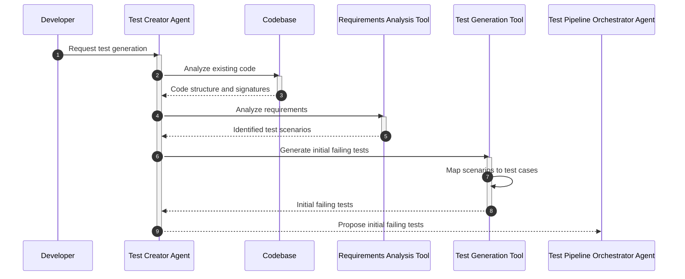

Creating an extremely detailed Mermaid Sequence Diagram for the "Test Creator Agent" in the context of a Test-Driven Development (TDD) workflow involves breaking down the agent's responsibilities into finer steps. The Test Creator Agent's primary role is to analyze the current state of the codebase and generate initial failing tests based on the requirements and code signatures.

Here is a detailed sequence diagram focusing on the Test Creator Agent's interactions and internal processes:

Explanation of Each Step:
Request for Test Generation: The process begins with the Developer requesting the Test Creator Agent to generate tests.

2. Analyze Existing Code: The Test Creator Agent analyzes the codebase to understand existing code structure and signatures.

4. Analyze Requirements: Utilizing a Requirements Analysis Tool, the agent identifies test scenarios based on project requirements.

6. Generate Initial Failing Tests: The Test Generation Tool is employed to map identified scenarios to specific test cases, generating initial failing tests.

9. Propose Tests to Orchestrator: Finally, the Test Creator Agent proposes these initial failing tests to the Test Pipeline Orchestrator Agent for further action.

This diagram provides a detailed view of the Test Creator Agent's process, breaking down its role into specific interactions and internal decision-making steps. This should help in understanding how the Test Creator Agent operates within the TDD workflow and interacts with other components and agents in the system.