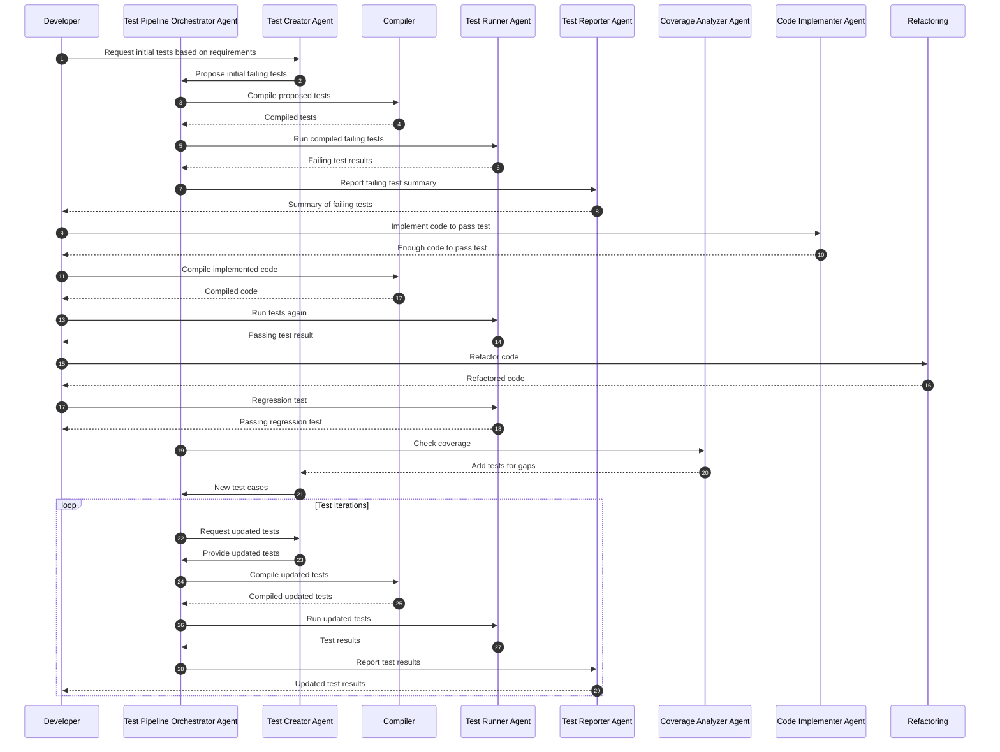

Creating a detailed Mermaid sequence diagram for the "Test Pipeline Orchestrator Agent" within your TDD workflow will involve illustrating the interactions between this agent and others in the system. The Test Pipeline Orchestrator Agent serves as the central coordinator for the testing process, managing the flow of information and actions between various agents.

Here's a sequence diagram focusing on the Test Pipeline Orchestrator Agent:

mermaid
Copy code
sequenceDiagram
autonumber

participant Developer
participant TestPipelineOrchestrator as Test Pipeline Orchestrator Agent
participant TestCreator as Test Creator Agent
participant Compiler
participant TestRunner as Test Runner Agent
participant TestReporter as Test Reporter Agent
participant CoverageAnalyzer as Coverage Analyzer Agent
participant CodeImplementer as Code Implementer Agent
participant Refactoring

Developer->>TestCreator: Request initial tests based on requirements
TestCreator->>TestPipelineOrchestrator: Propose initial failing tests
TestPipelineOrchestrator->>Compiler: Compile proposed tests
Compiler-->>TestPipelineOrchestrator: Compiled tests
TestPipelineOrchestrator->>TestRunner: Run compiled failing tests
TestRunner-->>TestPipelineOrchestrator: Failing test results
TestPipelineOrchestrator->>TestReporter: Report failing test summary
TestReporter-->>Developer: Summary of failing tests

Developer->>CodeImplementer: Implement code to pass test
CodeImplementer-->>Developer: Enough code to pass test
Developer->>Compiler: Compile implemented code
Compiler-->>Developer: Compiled code
Developer->>TestRunner: Run tests again
TestRunner-->>Developer: Passing test result

Developer->>Refactoring: Refactor code
Refactoring-->>Developer: Refactored code
Developer->>TestRunner: Regression test
TestRunner-->>Developer: Passing regression test

TestPipelineOrchestrator->>CoverageAnalyzer: Check coverage
CoverageAnalyzer-->>TestCreator: Add tests for gaps
TestCreator->>TestPipelineOrchestrator: New test cases

loop Test Iterations
    TestPipelineOrchestrator->>TestCreator: Request updated tests
    TestCreator->>TestPipelineOrchestrator: Provide updated tests
    TestPipelineOrchestrator->>Compiler: Compile updated tests
    Compiler-->>TestPipelineOrchestrator: Compiled updated tests
    TestPipelineOrchestrator->>TestRunner: Run updated tests
    TestRunner-->>TestPipelineOrchestrator: Test results
    TestPipelineOrchestrator->>TestReporter: Report test results
    TestReporter-->>Developer: Updated test results
end
Explanation of the Diagram:
Initial Test Creation and Compilation: The Developer initiates the TDD cycle by requesting tests. The Test Creator Agent proposes failing tests, which are compiled by the Compiler and managed by the Test Pipeline Orchestrator Agent.

Test Execution and Reporting: Compiled tests are executed, and results are managed and reported back to the Developer.

Code Implementation and Refactoring: The Developer interacts with the Code Implementer and Refactoring Agents, with the Orchestrator overseeing the compilation and testing of new and refactored code.

Coverage Analysis: The Orchestrator coordinates with the Coverage Analyzer to identify gaps, prompting the Test Creator to generate new tests.

Iterative Testing Loop: The process loops, with the Orchestrator managing the iterative cycle of testing, reporting, and refinement of tests based on the ongoing development.

This diagram provides a clear view of how the Test Pipeline Orchestrator Agent acts as the central coordinator in your TDD workflow, interfacing with various other agents and the Developer to ensure a smooth and efficient testing process.