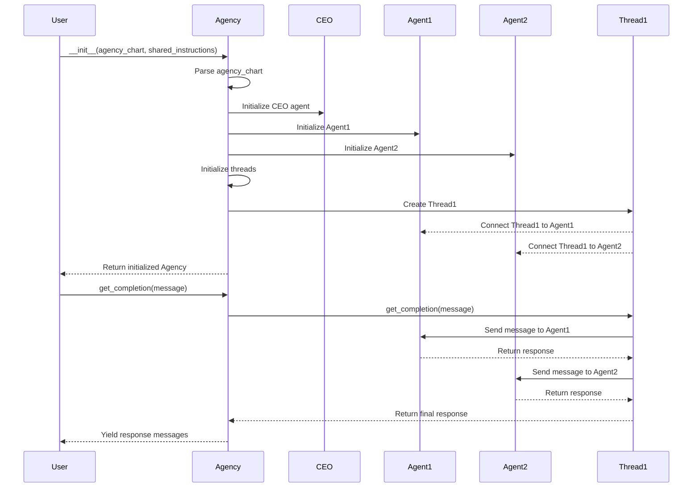

```mermaid
sequenceDiagram
    participant User
    participant Agency
    participant CEO
    participant Agent1
    participant Agent2
    participant Thread1
    User->>Agency: __init__(agency_chart, shared_instructions)
    Agency->>Agency: Parse agency_chart
    Agency->>CEO: Initialize CEO agent
    Agency->>Agent1: Initialize Agent1
    Agency->>Agent2: Initialize Agent2
    Agency->>Agency: Initialize threads
    Agency->>Thread1: Create Thread1 
    Thread1-->>Agent1: Connect Thread1 to Agent1
    Thread1-->>Agent2: Connect Thread1 to Agent2
    Agency-->>User: Return initialized Agency
    User->>Agency: get_completion(message) 
    Agency->>Thread1: get_completion(message)
    Thread1->>Agent1: Send message to Agent1
    Agent1-->>Thread1: Return response
    Thread1->>Agent2: Send message to Agent2 
    Agent2-->>Thread1: Return response
    Thread1-->>Agency: Return final response
    Agency-->>User: Yield response messages
```