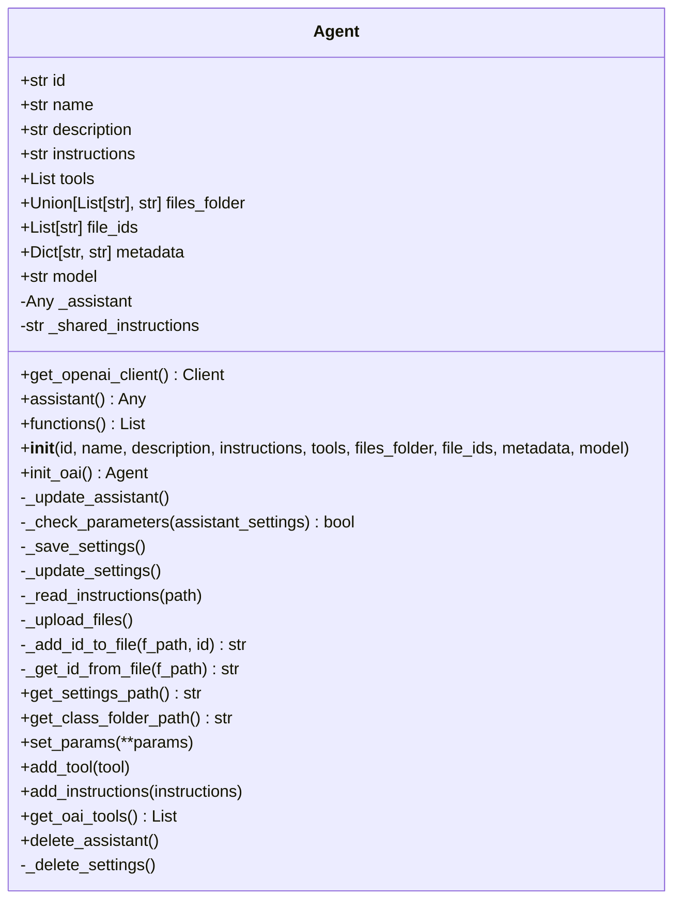

```mermaid
classDiagram
    class Agent {
        +str id
        +str name
        +str description
        +str instructions
        +List tools
        +Union[List[str], str] files_folder
        +List[str] file_ids
        +Dict[str, str] metadata
        +str model
        -Any _assistant
        -str _shared_instructions
        +get_openai_client() Client
        +assistant() Any
        +functions() List
        +__init__(id, name, description, instructions, tools, files_folder, file_ids, metadata, model)
        +init_oai() Agent
        -_update_assistant()
        -_check_parameters(assistant_settings) bool
        -_save_settings()
        -_update_settings()
        -_read_instructions(path)
        -_upload_files()
        -_add_id_to_file(f_path, id) str
        -_get_id_from_file(f_path) str
        +get_settings_path() str
        +get_class_folder_path() str
        +set_params(**params)
        +add_tool(tool)
        +add_instructions(instructions)
        +get_oai_tools() List
        +delete_assistant()
        -_delete_settings()
    }
```