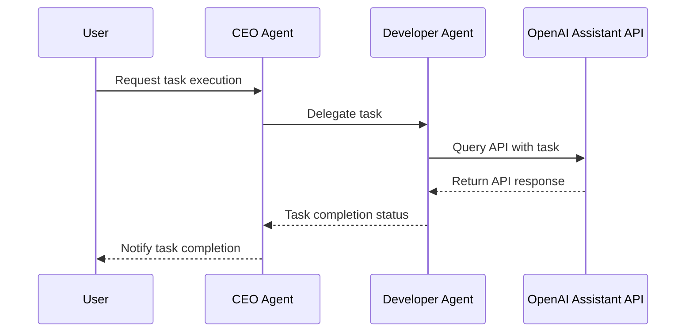

```mermaid
sequenceDiagram
    participant User
    participant CEO as CEO Agent
    participant Developer as Developer Agent
    participant AssistantAPI as OpenAI Assistant API

    User->>CEO: Request task execution
    CEO->>Developer: Delegate task
    Developer->>AssistantAPI: Query API with task
    AssistantAPI-->>Developer: Return API response
    Developer-->>CEO: Task completion status
    CEO-->>User: Notify task completion
```
Trying to inactivate an inactive participant (ScoreboardController)