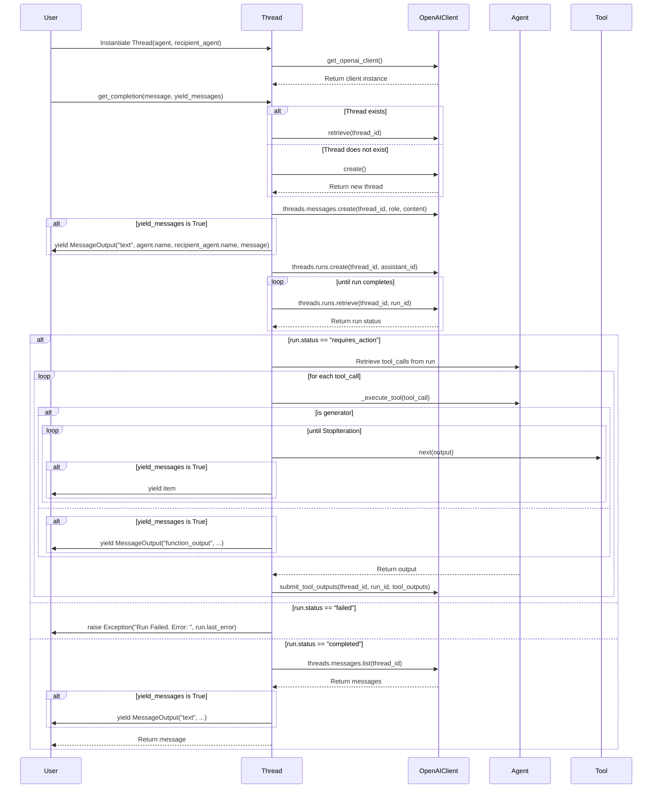

```mermaid
sequenceDiagram
    participant User
    participant Thread
    participant OpenAIClient
    participant Agent
    participant Tool

    User->>Thread: Instantiate Thread(agent, recipient_agent)
    Thread->>OpenAIClient: get_openai_client()
    OpenAIClient-->>Thread: Return client instance

    User->>Thread: get_completion(message, yield_messages)
    alt Thread exists
        Thread->>OpenAIClient: retrieve(thread_id)
    else Thread does not exist
        Thread->>OpenAIClient: create()
        OpenAIClient-->>Thread: Return new thread
    end

    Thread->>OpenAIClient: threads.messages.create(thread_id, role, content)
    alt yield_messages is True
        Thread->>User: yield MessageOutput("text", agent.name, recipient_agent.name, message)
    end

    Thread->>OpenAIClient: threads.runs.create(thread_id, assistant_id)
    loop until run completes
        Thread->>OpenAIClient: threads.runs.retrieve(thread_id, run_id)
        OpenAIClient-->>Thread: Return run status
    end

    alt run.status == "requires_action"
        Thread->>Agent: Retrieve tool_calls from run
        loop for each tool_call
            Thread->>Agent: _execute_tool(tool_call)
            alt is generator
                loop until StopIteration
                    Thread->>Tool: next(output)
                    alt yield_messages is True
                        Thread->>User: yield item
                    end
                end
            else
                alt yield_messages is True
                    Thread->>User: yield MessageOutput("function_output", ...)
                end
            end
            Agent-->>Thread: Return output
            Thread->>OpenAIClient: submit_tool_outputs(thread_id, run_id, tool_outputs)
        end
    else run.status == "failed"
        Thread->>User: raise Exception("Run Failed. Error: ", run.last_error)
    else run.status == "completed"
        Thread->>OpenAIClient: threads.messages.list(thread_id)
        OpenAIClient-->>Thread: Return messages
        alt yield_messages is True
            Thread->>User: yield MessageOutput("text", ...)
        end
        Thread-->>User: Return message
    end
```