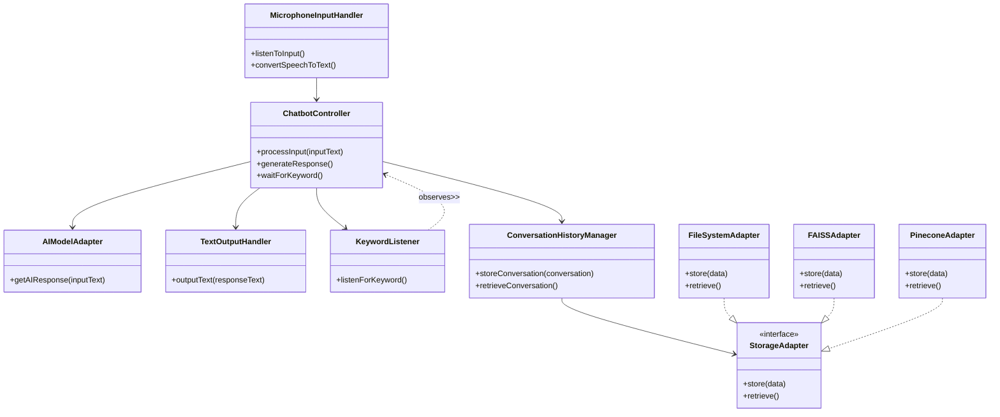

```mermaid
classDiagram
    class MicrophoneInputHandler {
        +listenToInput()
        +convertSpeechToText()
    }

    class ChatbotController {
        +processInput(inputText)
        +generateResponse()
        +waitForKeyword()
    }

    class AIModelAdapter {
        +getAIResponse(inputText)
    }

    class TextOutputHandler {
        +outputText(responseText)
    }

    class KeywordListener {
        +listenForKeyword()
    }

    class ConversationHistoryManager {
        +storeConversation(conversation)
        +retrieveConversation()
    }

    class StorageAdapter {
        <<interface>>
        +store(data)
        +retrieve()
    }

    class FileSystemAdapter {
        +store(data)
        +retrieve()
    }

    class FAISSAdapter {
        +store(data)
        +retrieve()
    }

    class PineconeAdapter {
        +store(data)
        +retrieve()
    }

    MicrophoneInputHandler --> ChatbotController
    ChatbotController --> AIModelAdapter
    ChatbotController --> TextOutputHandler
    ChatbotController --> KeywordListener
    ChatbotController --> ConversationHistoryManager
    KeywordListener ..> ChatbotController : observes>>
    ConversationHistoryManager --> StorageAdapter
    FileSystemAdapter ..|> StorageAdapter
    FAISSAdapter ..|> StorageAdapter
    PineconeAdapter ..|> StorageAdapter
```