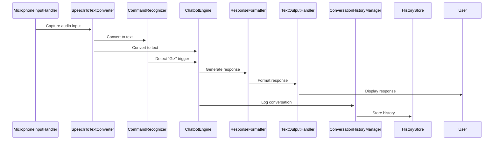

```mermaid
sequenceDiagram
    participant MicrophoneInputHandler
    participant SpeechToTextConverter
    participant CommandRecognizer
    participant ChatbotEngine
    participant ResponseFormatter
    participant TextOutputHandler
    participant ConversationHistoryManager
    participant HistoryStore

    MicrophoneInputHandler->>+SpeechToTextConverter: Capture audio input
    SpeechToTextConverter->>+CommandRecognizer: Convert to text
    SpeechToTextConverter->>+ChatbotEngine: Convert to text
    CommandRecognizer->>ChatbotEngine: Detect "Giz" trigger
    ChatbotEngine->>+ResponseFormatter: Generate response
    ResponseFormatter->>+TextOutputHandler: Format response
    TextOutputHandler->>User: Display response
    ChatbotEngine->>+ConversationHistoryManager: Log conversation
    ConversationHistoryManager->>+HistoryStore: Store history
```