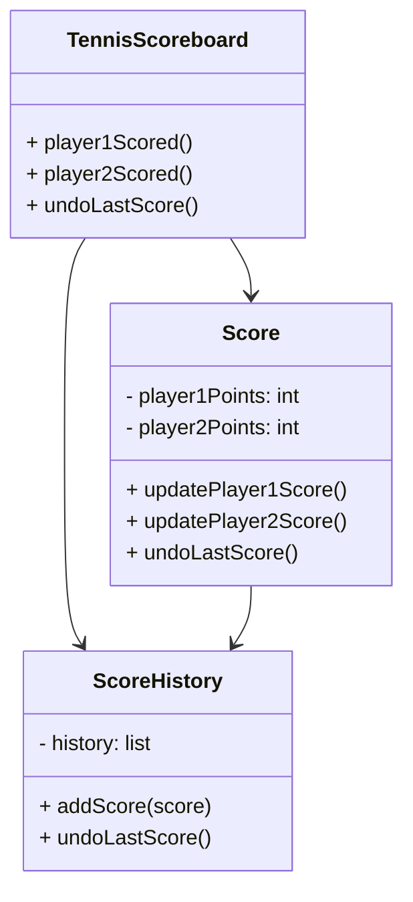

```mermaid
classDiagram
    class TennisScoreboard {
        + player1Scored()
        + player2Scored()
        + undoLastScore()
    }
    
    class Score {
        - player1Points: int
        - player2Points: int
        + updatePlayer1Score()
        + updatePlayer2Score()
        + undoLastScore()
    }

    class ScoreHistory {
        - history: list
        + addScore(score)
        + undoLastScore()
    }

    TennisScoreboard --> Score
    TennisScoreboard --> ScoreHistory
    Score --> ScoreHistory
```
