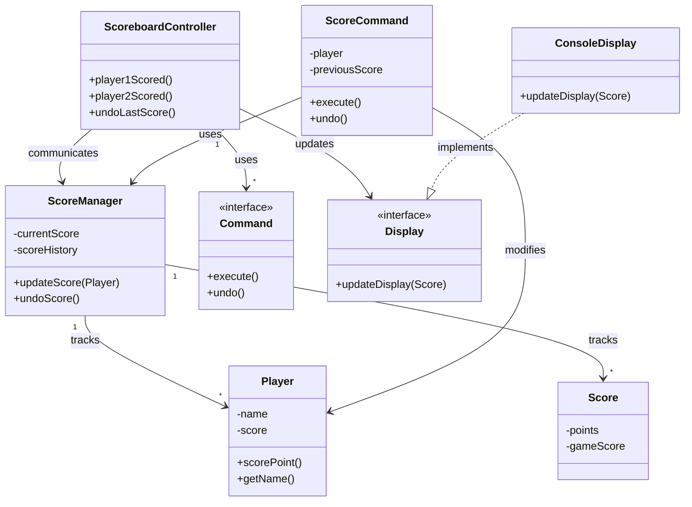

```mermaid
classDiagram
    class ScoreboardController {
      +player1Scored()
      +player2Scored()
      +undoLastScore()
    }

    class ScoreManager {
      +updateScore(Player)
      +undoScore()
      -currentScore
      -scoreHistory
    }

    class Player {
      -name
      -score
      +scorePoint()
      +getName()
    }

    class Score {
      -points
      -gameScore
    }

    class Command {
      <<interface>>
      +execute()
      +undo()
    }

    class ScoreCommand {
      -player
      -previousScore
      +execute()
      +undo()
    }

    class Display {
      <<interface>>
      +updateDisplay(Score)
    }

    class ConsoleDisplay {
      +updateDisplay(Score)
    }

    ScoreboardController "1" --> "*" Command : uses
    ScoreboardController --> ScoreManager : communicates
    ScoreManager "1" --> "*" Player : tracks
    ScoreManager "1" --> "*" Score : tracks
    ScoreCommand --> Player : modifies
    ScoreCommand --> ScoreManager : uses
    ScoreboardController --> Display : updates
    ConsoleDisplay ..|> Display : implements
```
