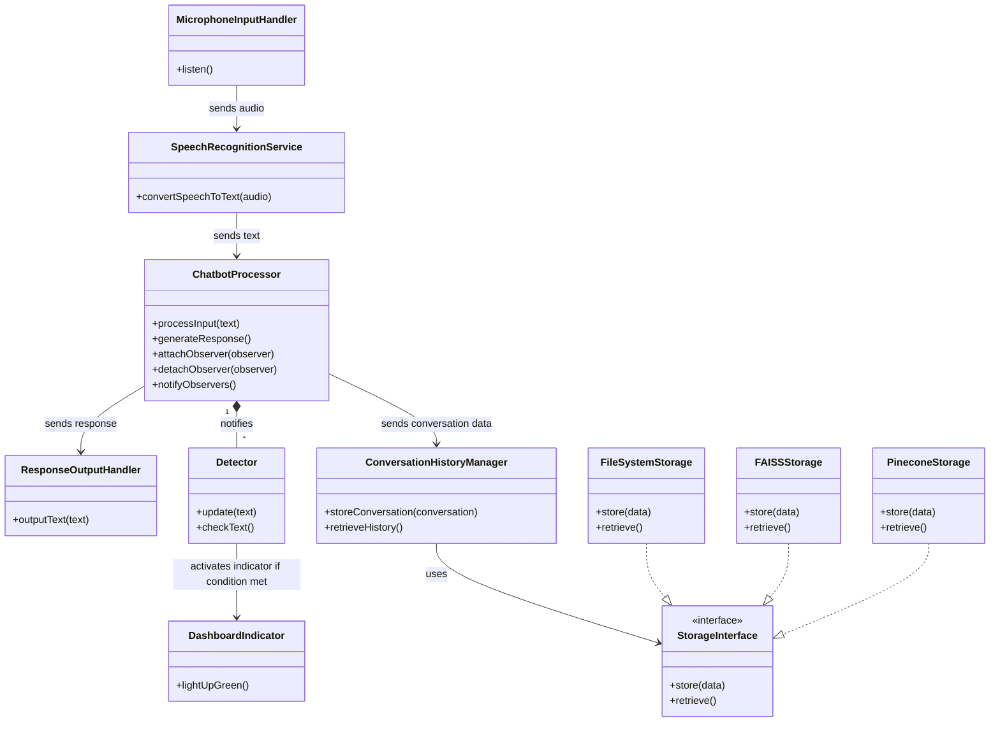

```mermaid
classDiagram
    class MicrophoneInputHandler {
        +listen()
    }
    class SpeechRecognitionService {
        +convertSpeechToText(audio)
    }
    class ChatbotProcessor {
        +processInput(text)
        +generateResponse()
        +attachObserver(observer)
        +detachObserver(observer)
        +notifyObservers()
    }
    class ResponseOutputHandler {
        +outputText(text)
    }
    class Detector {
        +update(text)
        +checkText()
    }
    class ConversationHistoryManager {
        +storeConversation(conversation)
        +retrieveHistory()
    }
    class StorageInterface {
        <<interface>>
        +store(data)
        +retrieve()
    }
    class FileSystemStorage {
        +store(data)
        +retrieve()
    }
    class FAISSStorage {
        +store(data)
        +retrieve()
    }
    class PineconeStorage {
        +store(data)
        +retrieve()
    }
    class DashboardIndicator {
        +lightUpGreen()
    }

    MicrophoneInputHandler --> SpeechRecognitionService : sends audio
    SpeechRecognitionService --> ChatbotProcessor : sends text
    ChatbotProcessor --> ResponseOutputHandler : sends response
    ChatbotProcessor "1" *-- "*" Detector : notifies
    ChatbotProcessor --> ConversationHistoryManager : sends conversation data
    ConversationHistoryManager --> StorageInterface : uses
    FileSystemStorage ..|> StorageInterface
    FAISSStorage ..|> StorageInterface
    PineconeStorage ..|> StorageInterface
    Detector --> DashboardIndicator : activates indicator if condition met
```
