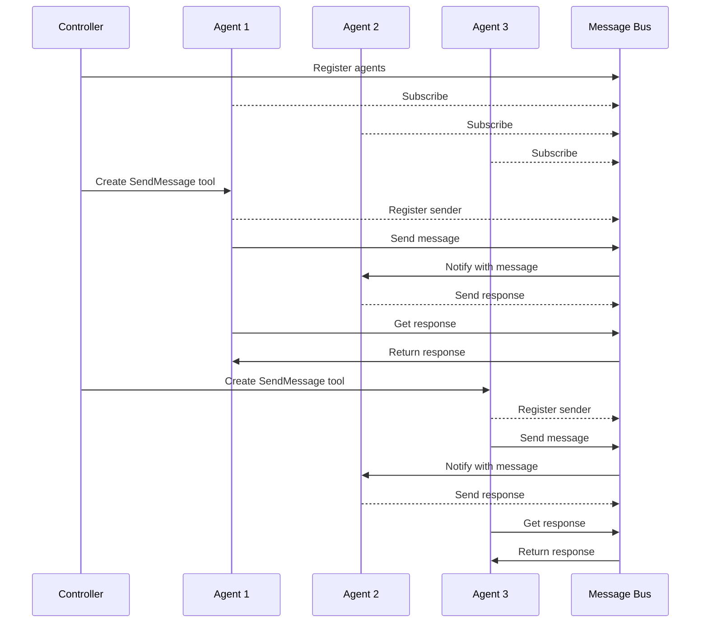

```mermaid
sequenceDiagram
Participant Controller as Controller
Participant Agent1 as Agent 1 
Participant Agent2 as Agent 2
Participant Agent3 as Agent 3
Participant MessageBus as Message Bus

Controller->>MessageBus: Register agents
Agent1-->>MessageBus: Subscribe 
Agent2-->>MessageBus: Subscribe
Agent3-->>MessageBus: Subscribe

Controller->>Agent1: Create SendMessage tool 
Agent1-->>MessageBus: Register sender

Agent1->>MessageBus: Send message
MessageBus->>Agent2: Notify with message
Agent2-->>MessageBus: Send response 

Agent1->>MessageBus: Get response
MessageBus->>Agent1: Return response

Controller->>Agent3: Create SendMessage tool
Agent3-->>MessageBus: Register sender 

Agent3->>MessageBus: Send message 
MessageBus->>Agent2: Notify with message
Agent2-->>MessageBus: Send response

Agent3->>MessageBus: Get response
MessageBus->>Agent3: Return response
```
