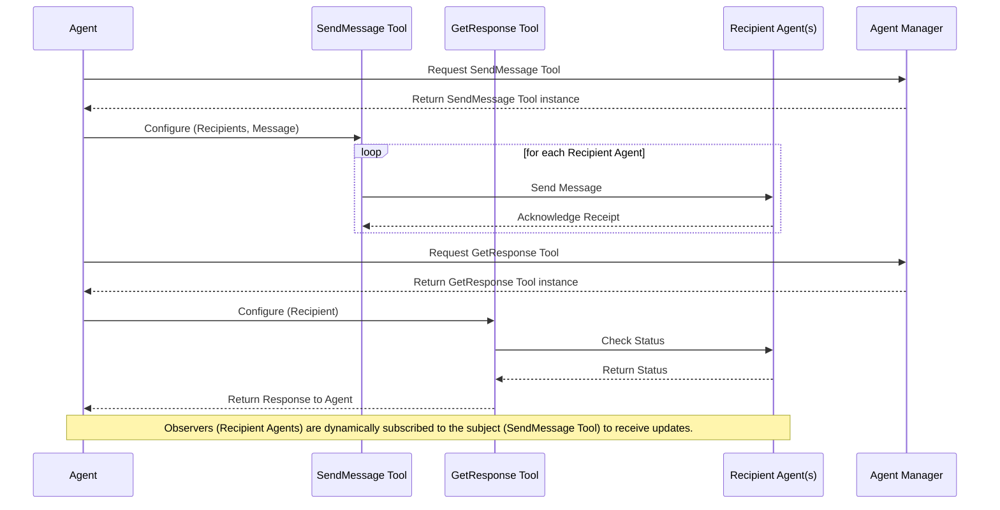

```mermaid
sequenceDiagram
    participant A as Agent
    participant SM as SendMessage Tool
    participant GR as GetResponse Tool
    participant RA as Recipient Agent(s)
    participant AM as Agent Manager

    A->>AM: Request SendMessage Tool
    AM-->>A: Return SendMessage Tool instance
    A->>SM: Configure (Recipients, Message)
    loop for each Recipient Agent
        SM->>RA: Send Message
        RA-->>SM: Acknowledge Receipt
    end
    A->>AM: Request GetResponse Tool
    AM-->>A: Return GetResponse Tool instance
    A->>GR: Configure (Recipient)
    GR->>RA: Check Status
    RA-->>GR: Return Status
    GR-->>A: Return Response to Agent

    Note over A,RA: Observers (Recipient Agents) are dynamically subscribed to the subject (SendMessage Tool) to receive updates.
```