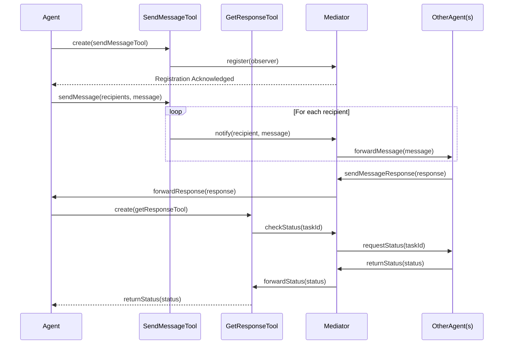

```mermaid
sequenceDiagram
    participant A as Agent
    participant SM as SendMessageTool
    participant GR as GetResponseTool
    participant M as Mediator
    participant O as OtherAgent(s)

    A->>SM: create(sendMessageTool)
    SM->>M: register(observer)
    M-->>A: Registration Acknowledged
    A->>SM: sendMessage(recipients, message)
    loop For each recipient
        SM->>M: notify(recipient, message)
        M->>O: forwardMessage(message)
    end
    O->>M: sendMessageResponse(response)
    M->>A: forwardResponse(response)
    A->>GR: create(getResponseTool)
    GR->>M: checkStatus(taskId)
    M->>O: requestStatus(taskId)
    O->>M: returnStatus(status)
    M->>GR: forwardStatus(status)
    GR-->>A: returnStatus(status)
```