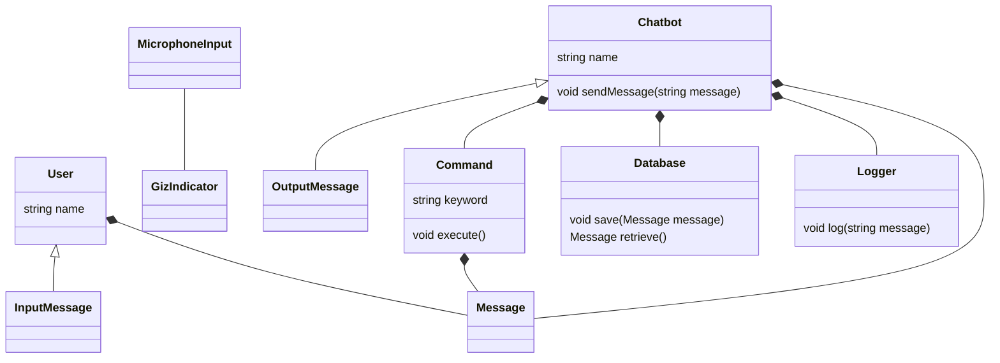

```mermaid
classDiagram
  class User
  User : string name

  class Chatbot
  Chatbot : string name
  Chatbot : void sendMessage(string message)

  class Message
  class InputMessage
  class OutputMessage
  class MicrophoneInput
  class GizIndicator

  class Command
  Command : string keyword
  Command : void execute()

  class Database
  Database : void save(Message message)
  Database : Message retrieve()

  class Logger
  Logger : void log(string message)

  User <|-- InputMessage
  Chatbot <|-- OutputMessage
  Chatbot *-- Command
  Chatbot *-- Database
  Chatbot *-- Logger
  MicrophoneInput -- GizIndicator
  User *-- Message
  Chatbot *-- Message
  Command *-- Message
```